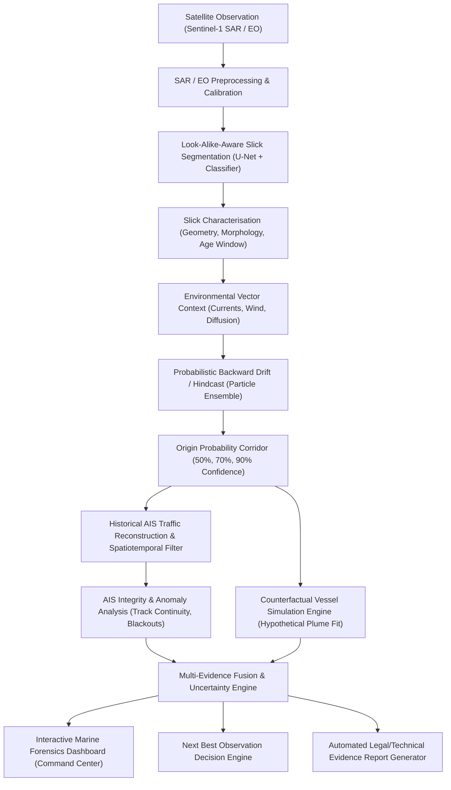

# MARLIN-X: Marine Pollution Linkage, Attribution & Intelligence Network
## Architectural Blueprint & System Specifications (SIH 2026 - NTRO SIH26143)

> **Research Paradigm:** Physics-Guided, Multimodal & Uncertainty-Aware Marine Pollution Forensics

---

### 1. System Overview & Core Philosophy

MARLIN-X addresses the NTRO Problem Statement SIH26143 (*"Leveraging satellite imagery to determine Oil spills at sea along with AIS data correlations to identify vessel responsible for the spill"*).

Unlike conventional dashboards that naively overlay dark SAR patches onto raw AIS vessel positions, MARLIN-X implements a **physics-guided, counterfactual marine forensic engine**. It recognizes critical scientific boundary conditions:
- **Dark SAR features are not inherently oil slicks** (biogenic films, low-wind zones, internal waves, rain cells, ship wakes, and current fronts produce look-alikes).
- **AIS blackouts/anomalies are not legal proof of guilt**; they represent evidence vectors for structured investigation.
- **Physical compatibility is distinct from criminal attribution**: The system computes a *Counterfactual Plume Fit* and multi-evidence compatibility score, quantifying uncertainty and presenting alternative hypotheses.

---

### 2. End-to-End System Pipeline



---

### 3. Core Research Innovations

#### A. Look-Alike-Aware Segmentation & Classification
- Multi-head / modular classifier estimating:
  1. **Probable Oil Slick**
  2. **Environmental Look-alike** (Low wind, biogenic film, internal waves, ship wake)
  3. **No-Oil Background**
  4. **Uncertain / Human Review Required**
- Outputs pixel-level mask, slick confidence score, and epistemic uncertainty map.

#### B. Probabilistic Release Window & Slick Morphology
- Computes perimeter, area, length, width, orientation angle, and damping index.
- Estimates **Earliest Plausible Release Time**, **Latest Plausible Release Time**, and **Most Probable Release Interval** with calibrated confidence percentages.

#### C. Ensemble Probabilistic Backward Hindcast
- Uses Lagrangian particle tracking backward in time by reversing surface currents and wind drag.
- Incorporates Monte Carlo perturbations on:
  - Surface current velocity ($\vec{u}_{curr} \pm \sigma_{curr}$)
  - Surface wind velocity ($\vec{u}_{wind} \pm \sigma_{wind}$)
  - Windage coefficient ($W_d \in [0.01, 0.035]$)
  - Horizontal turbulent diffusion ($K_h$)
- Generates **50%**, **70%**, and **90% Origin Probability Iso-Corridors** and origin centroid.

#### D. Forward Slick Drift Prediction
- Simulates future slick transport (+1h, +3h, +6h, +12h, +24h) from observed state and origin.
- Visualizes particle dispersion, coastal impact probability, and sensitive marine area exposure.

#### E. AIS Integrity & Anomaly Analytics
- Assesses candidate vessel AIS streams for:
  - Track gap duration & distance jump
  - Kinematic impossibility (speed over ground > 35 knots, unrealistic acceleration)
  - Heading vs course inconsistency
  - AIS blackout timing relative to spill release window
- Produces **AIS Reliability Ratings**: `Reliable`, `Incomplete`, `Suspicious`, `Potentially Manipulated`, `Insufficient Data`.

#### F. Dark / Unmatched Vessel Detection
- Cross-references SAR-detected vessel targets against temporal-spatial AIS transmissions.
- Highlights non-broadcasting targets as **Unmatched Satellite Vessels**.

#### G. Counterfactual Vessel Simulation Engine (Major Differentiator)
- For each candidate vessel present in the origin corridor during the release window:
  1. Instantiates a hypothetical release scenario at candidate position $(x_v, y_v, t_v)$.
  2. Simulates forward drift of the candidate plume to satellite observation time $t_{sat}$.
  3. Computes **Physical Compatibility Metrics**:
     - Spatial IoU Overlap ($J$)
     - Centroid Shift Distance ($\Delta d$)
     - Orientation Angle Delta ($\Delta \theta$)
     - Area Multiplier Ratio ($R_A$)
     - Particle Density Cross-Correlation ($C_p$)
  4. Outputs **Counterfactual Physical Compatibility Score (0–100%)**.

#### H. Multi-Evidence Fusion & Explainable Assessment
- Integrates eight distinct evidence channels:
  1. Spatial Proximity
  2. Temporal Window Overlap
  3. Trajectory Alignment
  4. Counterfactual Plume Fit
  5. AIS Integrity Rating
  6. Satellite-Vessel Matching
  7. Environmental Vector Consistency
  8. Alternative Source Proximity (Platforms, Pipelines, Natural Seeps)
- Generates transparent **Evidence FOR**, **Evidence AGAINST**, and **Alternative Hypotheses**.

#### I. Recommended Next Observation Engine
- Evaluates information entropy of the origin corridor and candidate rank margin.
- Suggests optimal sensor tasking (e.g. *"Task Sentinel-1 SAR over Sector B (12.4°N, 74.8°E) to resolve Candidate A/B ambiguity"*).

---

### 4. Technical Stack & Data Architecture

| Layer | Technology Choice | Rationale |
| :--- | :--- | :--- |
| **Frontend UI** | React 18, TypeScript, Vite, Tailwind CSS, Lucide Icons | High performance, modular command-center layout |
| **Geospatial Map** | MapLibre GL JS / Leaflet, Canvas Particle Renderers | Smooth rendering of vector fields, particle streams, and polygons |
| **Charts & Analytics** | Recharts, Lucide Icons | Responsive telemetry charts, anomaly timelines, evidence breakdown |
| **Backend API** | FastAPI (Python 3.13), Pydantic v2 | High-throughput async REST endpoints, strict schema validation |
| **Geospatial & Physics** | Shapely, PyPROJ, NumPy, SciPy, Pandas | Vector math, spatial index queries, particle drift differential equations |
| **ML Engine** | PyTorch / Lightweight U-Net & ResNet Classifier | Modular segmentation and look-alike classification |
| **Data Storage** | SQLite / PostGIS Spatial DB, GeoJSON, Parquet | Flexible persistence with seamless offline fallback |
| **Reporting Engine** | Jinja2 + HTML5/CSS Print Engine | Standards-compliant, audit-ready evidence PDF/HTML reports |

---

### 5. Data Flow Architecture

```
[Satellite SAR (Sentinel-1)]  [AIS Telemetry Feed]  [ERA5 Wind / OSCAR Currents]
             │                        │                           │
             ▼                        ▼                           ▼
[Preprocessed Backscatter]   [Vessel Track Filter]     [Environmental Vector Field]
             │                        │                           │
             ├────────────────────────┴───────────────────────────┤
             ▼                                                    ▼
 [Slick Geometry & Feature Extractor]             [Lagrangian Ensemble Hindcaster]
             │                                                    │
             └────────────────────────┬───────────────────────────┘
                                      ▼
                        [Origin Probability Corridor]
                                      │
                                      ▼
                   [Counterfactual Simulation Engine]
                                      │
                                      ▼
                     [Multi-Evidence Fusion & Scoring]
                                      │
                     ┌────────────────┴────────────────┐
                     ▼                                 ▼
       [Interactive Dashboard UI]         [PDF / HTML Evidence Report]
```

---

### 6. Phase-by-Phase Implementation Plan

- **Phase 1: Project Scaffold & Foundation Shell**
  - Scaffold `marlin-x` directory structure (`frontend`, `backend`, `ml`, `data`, `simulations`, `docs`).
  - Configure FastAPI backend, Pydantic schemas, health check, system status.
  - Configure Vite + React + TypeScript + Tailwind CSS command-center dashboard shell.
  - Implement full backend and frontend builds and launch verification.

- **Phase 2: Geospatial Command Center Map & Layers**
  - Interactive map with layer toggles (Satellite SAR overlay, Slick Mask, Wind/Current vectors, Vessel tracks, Infrastructure, Origin heatmap).
  - Time-slider playback and spatial control panel.

- **Phase 3: Oil-Slick Segmentation & Characterisation Engine**
  - ML inference pipeline for SAR image segmentation.
  - Feature extractor for geometry (Area, Centroid, Damping, Orientation) & look-alike classification.

- **Phase 4: Historical AIS Reconstruction & Anomaly Engine**
  - AIS track loader, spatiotemporal bounding box filter, and candidate selector.
  - AIS anomaly detector (blackouts, speed jumps, heading mismatch, identity verification).

- **Phase 5: Physics-Guided Lagrangian Drift Engine (Backward & Forward)**
  - Reversible particle drift simulator with windage and current vectors.
  - Monte Carlo origin probability corridor calculator (50%, 70%, 90% contours).
  - Forward drift forecast engine (+1h to +24h).

- **Phase 6: Counterfactual Vessel Simulation Engine**
  - Hypothetical plume release simulator per candidate vessel.
  - Spatial IoU, centroid delta, particle density correlation, and plume shape matcher.

- **Phase 7: Multi-Evidence Fusion & Explainability System**
  - Fuses 8 evidence channels into transparent Investigation Priority ratings (`HIGH`, `MEDIUM`, `LOW`).
  - Generates bulleted Evidence FOR, Evidence AGAINST, and Alternative Hypotheses.

- **Phase 8: Recommended Next Observation Engine**
  - Entropy reduction evaluator for sensor re-tasking (SAR, optical, drone, maritime patrol).

- **Phase 9: Automated Investigation Report Generator**
  - Multi-page HTML/PDF evidence report with maps, metrics, track timelines, counterfactual comparisons, and provenance metadata.

- **Phase 10: Final System Integration, Demo Scenario & Polish**
  - `MARLIN-X-DEMO-001` complete incident workflow.
  - End-to-end verification, loading states, error boundaries, and demonstration readiness.

---

### 7. DEMO MODE Strategy (`MARLIN-X-DEMO-001`)

To guarantee 100% offline reliability during SIH presentations without dependency on external APIs:
- Pre-packaged synthetic/sample incident `MARLIN-X-DEMO-001` located off the Coast of Mangalore / Arabian Sea.
- Realistically calibrated SAR VV/VH raster slice + ground-truth slick polygon.
- Full ERA5 wind field ($12.5 \text{ knots, } 240^\circ$) and OSCAR current field ($0.45 \text{ m/s, } 115^\circ$).
- 4 Candidate Vessels:
  - **Vessel Alpha (MMSI 413291000, Tanker)**: High physical compatibility (89%), suspicious 2.5h AIS gap near origin corridor.
  - **Vessel Beta (MMSI 352001240, Cargo)**: Crosses area 4 hours early (Low temporal fit 22%).
  - **Vessel Gamma (MMSI 563098110, Container)**: Parallel course, no AIS gap, low plume fit (31%).
  - **Unmatched Satellite Target (Dark Ship)**: Visible in SAR, no AIS signal.
- Full counterfactual simulation results pre-generated and ready for real-time recalculation upon parameter adjustment.

---
*MARLIN-X Engineering Team — NTRO SIH26143 Implementation*
